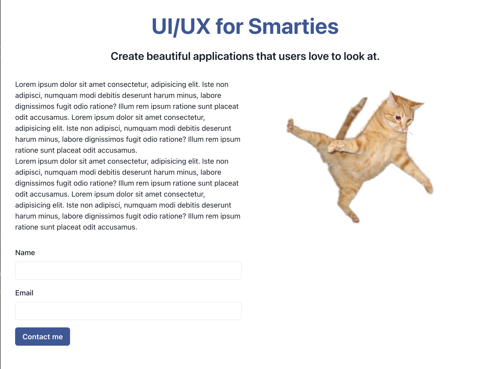

# UI/UX Crash Course

This project has been created to help demonstrate some of the core principles of coherent web design and responsive layouts! Ive tried to keep the code small and simple to put the focus on how CSS Grid, consistent spacing, element hierarchy, alignment and color all have large impact on the experience of users. 

## Tech

To make the live-demo a speedy process, I went with a lightweight [Vite](https://vitejs.dev/) application using [Chakra UI](https://chakra-ui.com/) as the CSS component library, a pretty and un-opinionated framework that I highly recommend giving a go in your own projects.
